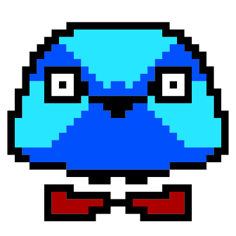

<h1 align="center" style="font-size:3em; font-weight: bold;">Hi 👋 I am Ridvan</h1>

## **Who Am I?**

A backend software developer who really wants to know everything about software development. I am currently working on my own projects. If I give a little hint, I can say that I am developing on web and game technologies.

## **Skills**

